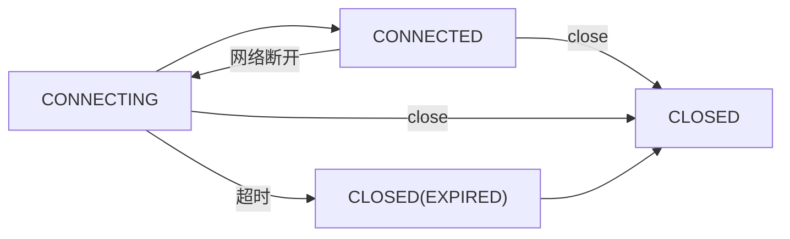
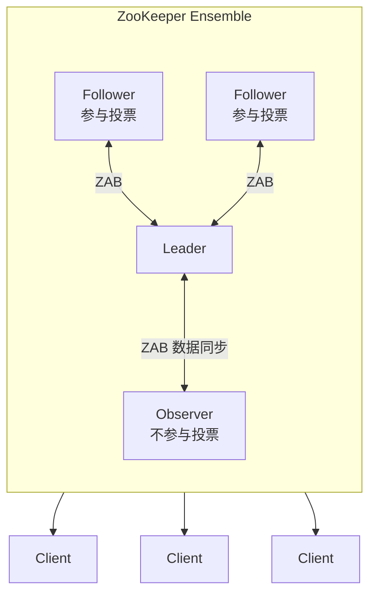
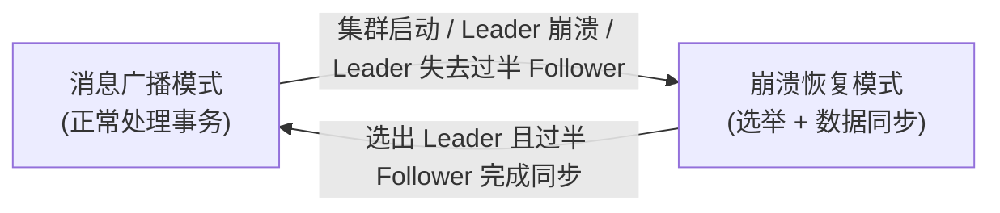
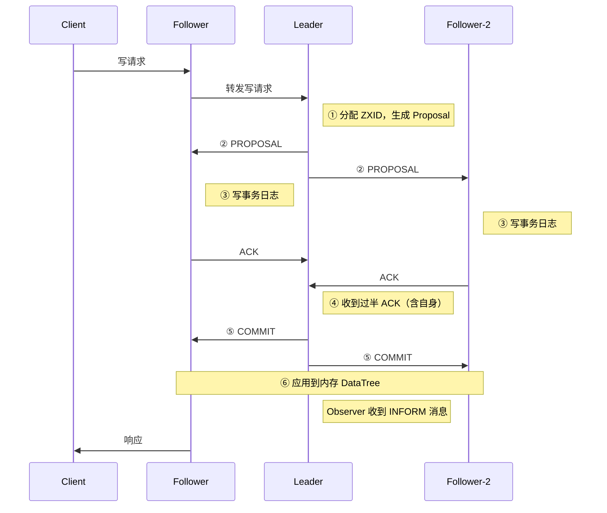
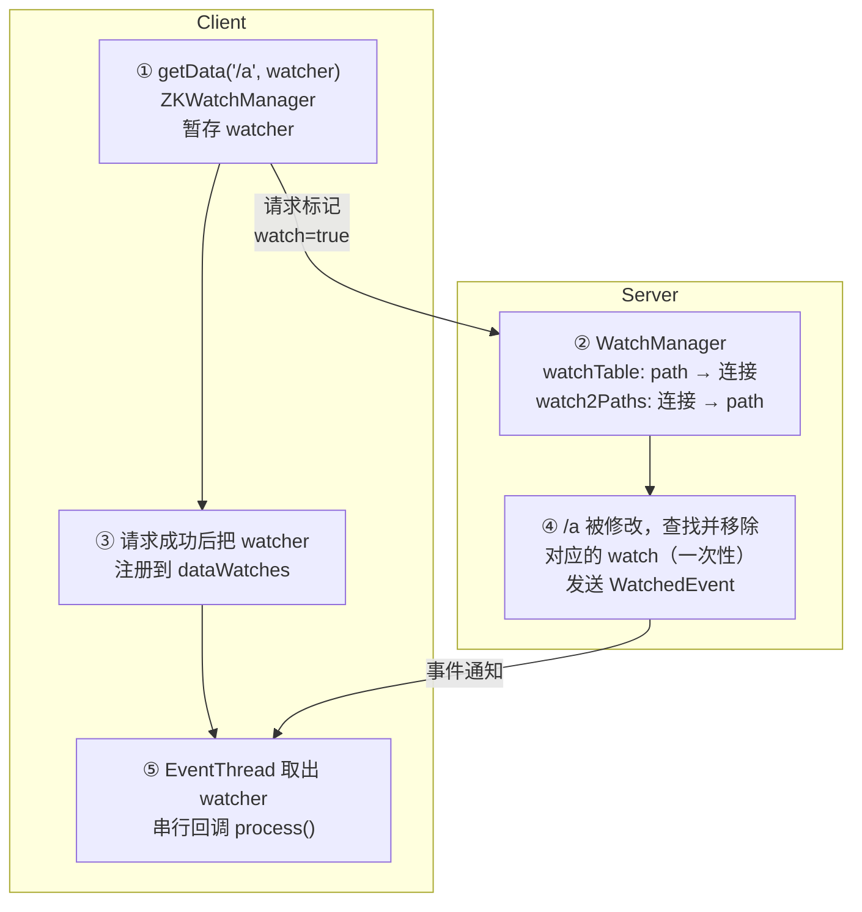

# 1. 基础介绍


**Apache ZooKeeper** 是一个开源的**分布式协调服务**。它最初由 Yahoo! 研究院开发，作为 Hadoop 的子项目，后来成为 Apache 顶级项目。它的设计参考了 Google 的 Chubby 论文。

ZooKeeper 的定位是：**为分布式应用提供高性能、高可用、顺序一致的协调原语**。很多分布式系统要解决的共性问题，例如配置管理、命名服务、分布式锁、集群选主、成员管理，都可以基于 ZooKeeper 实现，无需每个系统各自开发一套。

ZooKeeper 的特点：

| 特性             | 说明                                                         |
| ---------------- | ------------------------------------------------------------ |
| **顺序一致性**   | 同一客户端发起的更新请求，按发送顺序执行                     |
| **原子性**       | 一次更新要么全部成功，要么全部失败，不存在中间状态           |
| **单一系统视图** | 无论客户端连接哪台服务器，看到的数据视图一致                 |
| **可靠性**       | 更新一旦成功，结果会持久保存，直到被下一次更新覆盖           |
| **及时性**       | 客户端在一定时间范围内能读到最新数据，属于最终一致读         |
| **高性能**       | 数据全量存于内存，适合**读多写少**的场景，读写比约 10:1 时表现最好 |
| **高可用**       | 集群中只要过半节点存活，服务就可用                           |

典型应用场景：

- **配置中心**：集中管理配置，变更后实时推送给客户端
- **命名服务**：统一命名，生成全局唯一 ID，使用顺序节点的自增序号生成全局唯一 ID
- **服务注册与发现**：如 Dubbo 的注册中心，服务进程在启动时创建临时节点，节点数据包含地址、权重等信息，服务宕机后会话超时，节点被自动删除，服务消费者获取服务提供者列表并监听子节点动态变化
- **分布式锁**：排他锁、读写锁，每个客户端在锁目录下创建临时顺序节点，获得最小序号节点者获得锁，解锁时删除自己获得的节点，其他客户端监听前一个节点的删除时事件
- **Leader 选举**：如 HBase Master、Hadoop HDFS NameNode HA、早期 Kafka Controller，所有候选者创建临时顺序节点，序号最小的成为 Leader，其余节点监听前一个节点
- **分布式队列与屏障（Barrier）**：在某个节点下创建临时顺序节点，然后获取该节点下的所有子节点，如果自己不是序号最小的子节点则等待，监听前一个节点，收到通知后重复判断步骤

ZooKeeper 与其他协调服务的对比：

| 维度       | ZooKeeper                                  | etcd                               | Consul             |
| ---------- | ------------------------------------------ | ---------------------------------- | ------------------ |
| 开发语言   | Java                                       | Go                                 | Go                 |
| 一致性协议 | ZAB                                        | Raft                               | Raft               |
| 数据模型   | 树形 ZNode                                 | 扁平 KV（支持前缀查询）+ MVCC      | KV + 服务目录      |
| 接口       | 自定义 TCP 协议                            | gRPC / HTTP                        | HTTP / DNS         |
| 监听机制   | Watcher（传统为一次性，3.6+ 支持持久监听） | Watch（基于 revision，可回溯历史） | Blocking Query     |
| 临时数据   | 临时节点（绑定会话）                       | Lease（租约）                      | Session / 健康检查 |
| 典型用户   | Hadoop 生态、Dubbo                         | Kubernetes                         | 服务网格、服务发现 |

# 2. 核心概念

## 2.1 ZNode

ZooKeeper 的数据模型是一棵层次化的树，结构类似 Unix 文件系统。树中的每个节点称为 ZNode，用斜杠分隔的路径唯一标识。

```
/
├── zookeeper            (系统保留节点)
│   └── quota
├── app1
│   ├── config           -> "timeout=3000"
│   └── servers
│       ├── server0000000001
│       └── server0000000002
└── locks
    └── lock-0000000005
```

- **每个 ZNode 都可以存数据，也可以有子节点**。它既像文件，又像目录。
- 数据读写是**原子性**的，每次都整体读取或整体替换，不支持追加或部分修改。
- 单个节点默认最多存储 **1MB** 数据（由 `jute.maxbuffer` 控制）。实际使用中应远小于这个值，通常在 KB 级别。
- 路径必须是**绝对路径**，不支持相对路径。

ZNode 有多种类型：

| 类型                                    | 说明                                                         | 典型用途              |
| --------------------------------------- | ------------------------------------------------------------ | --------------------- |
| 持久节点（PERSISTENT）                  | 创建后一直存在，直到被显式删除                               | 配置存储              |
| 持久顺序节点（PERSISTENT_SEQUENTIAL）   | 持久节点，名称后自动追加 10 位单调递增序号                   | 分布式队列、全局 ID   |
| 临时节点（EPHEMERAL）                   | 与客户端会话绑定，会话结束后自动删除。临时节点不能有子节点   | 服务注册、存活检测    |
| 临时顺序节点（EPHEMERAL_SEQUENTIAL）    | 临时节点加自增序号                                           | 分布式锁、Leader 选举 |
| 容器节点（CONTAINER，3.5.3+）           | 最后一个子节点被删除后，会在将来某个时刻被服务端自动清理     | 锁、选举的父目录      |
| TTL 节点（PERSISTENT_WITH_TTL，3.5.3+） | 在 TTL 时间内没有修改且没有子节点时自动删除。需要开启 `extendedTypesEnabled=true` | 临时性的持久数据      |

每个 ZNode 除了数据，还维护一份 Stat 元信息：

| 字段             | 含义                                                   |
| ---------------- | ------------------------------------------------------ |
| `cZxid`          | 创建该节点的事务 ID                                    |
| `ctime`          | 创建时间                                               |
| `mZxid`          | 最后一次修改该节点数据的事务 ID                        |
| `mtime`          | 最后修改时间                                           |
| `pZxid`          | 最后一次修改子节点列表的事务 ID                        |
| `cversion`       | 子节点版本号，子节点列表每变更一次加 1                 |
| `dataVersion`    | 数据版本号，数据每修改一次加 1                         |
| `aclVersion`     | ACL 版本号                                             |
| `ephemeralOwner` | 如果是临时节点，记录所属会话的 SessionID；持久节点为 0 |
| `dataLength`     | 数据长度                                               |
| `numChildren`    | 子节点数量                                             |

ZooKeeper 用 `version` 实现**乐观锁（CAS）**。在 `set` 或 `delete` 时传入期望的版本号，如果与当前版本不一致，操作就会失败（`BadVersionException`）。

## 2.2 Session

客户端与服务端之间通过 **TCP 长连接** 建立会话：

- 客户端启动时随机连接集群中的某台服务器，并协商会话超时时间（`sessionTimeout`）。
- 客户端通过定期发送**心跳（PING）** 维持会话。
- 连接断开后，客户端会自动尝试重连集群中的其他服务器。在超时时间内重连成功，会话仍然有效（状态为 `CONNECTED`）。
- 超时后服务端判定会话过期（`EXPIRED`），该会话创建的**所有临时节点都会被删除**，客户端必须新建会话。

会话状态流转：



## 2.3 Watcher

Watcher 是 ZooKeeper 实现**发布/订阅**的核心。客户端在读取节点（`getData`、`exists`、`getChildren`）时可以注册 Watcher。节点发生变化时，服务端会向客户端发送一次事件通知。

**Watcher 的特点：**

1. **一次性触发**：传统 Watcher 触发一次后就失效，需要重新注册才能继续监听。3.6.0 起新增了**持久监听（Persistent Watch）**和**持久递归监听**，通过 `addWatch` 注册，触发后不会失效。
2. **轻量**：通知只包含事件类型、节点路径和通知状态，**不包含变更后的数据**。客户端需要自己再去读取。
3. **顺序性**：客户端先收到 Watch 事件，之后才能看到新数据。
4. **串行回调**：客户端的 Watcher 回调在单独的 EventThread 中串行执行，回调中不应执行耗时操作。

事件类型与触发关系：

| 注册方式      | NodeCreated | NodeDeleted | NodeDataChanged | NodeChildrenChanged |
| ------------- | :---------: | :---------: | :-------------: | :-----------------: |
| `exists`      |      ✅      |      ✅      |        ✅        |                     |
| `getData`     |             |      ✅      |        ✅        |                     |
| `getChildren` |             |      ✅      |                 |          ✅          |

## 2.4 ACL

ZooKeeper 使用 `scheme:id:permissions` 的形式控制权限。ACL **不会继承**。每个节点的 ACL 独立设置，子节点不会自动继承父节点的权限。

权限有以下几种：

| 权限   | 缩写 | 说明                     |
| ------ | ---- | ------------------------ |
| CREATE | c    | 创建子节点               |
| DELETE | d    | 删除子节点               |
| READ   | r    | 读取节点数据和子节点列表 |
| WRITE  | w    | 修改节点数据             |
| ADMIN  | a    | 设置 ACL                 |

授权模式包含：

| Scheme          | 说明                                               | 示例                       |
| --------------- | -------------------------------------------------- | -------------------------- |
| `world`         | 只有一个 id：`anyone`，代表所有人                  | `world:anyone:cdrwa`       |
| `auth`          | 当前会话中已认证的用户                             | `auth:user:pwd:cdrwa`      |
| `digest`        | 用户名 + 密码摘要，摘要为 `BASE64(SHA1(user:pwd))` | `digest:user:BASE64:cdrwa` |
| `ip`            | 按客户端 IP 或网段授权                             | `ip:192.168.1.0/24:r`      |
| `x509` / `sasl` | 证书或 Kerberos 认证                               | —                          |

# 3. 安装与部署

ZooKeeper 需要有 JDK 8 及以上的环境，然后从官网下载二进制压缩包。

ZooKeeper 端口 2181 用于客户端连接，端口 2888 用于 Follower 与 Leader 之间的数据同步和通信，端口 3888 用于 Leader 选举，端口 8080 用于 AdminServer。

## 3.1 单机部署

```bash
tar -zxvf apache-zookeeper-3.8.4-bin.tar.gz -C /opt/
cd /opt/apache-zookeeper-3.8.4-bin
cp conf/zoo_sample.cfg conf/zoo.cfg
mkdir -p /data/zookeeper/{data,logs}
```

编辑配置文件 `conf/zoo.cfg`：

```ini
# 基本时间单位（毫秒），心跳间隔、超时都以它为基准
tickTime=2000
# 快照存储目录
dataDir=/data/zookeeper/data
# 事务日志目录（建议与 dataDir 分开，最好放在独立磁盘）
dataLogDir=/data/zookeeper/logs
# 客户端连接端口
clientPort=2181
# 单个客户端 IP 的最大连接数
maxClientCnxns=60
# 自动清理：保留的快照数量和清理间隔（小时）
autopurge.snapRetainCount=5
autopurge.purgeInterval=24
```

启动程序：

```bash
bin/zkServer.sh start
bin/zkServer.sh status
```

## 3.2 集群部署

以 3 节点为例，在三台机器配置相同的集群配置 `zoo.cfg`：

```ini
tickTime=2000
# Follower 初始连接并同步 Leader 的最长时间：initLimit * tickTime
initLimit=10
# Follower 与 Leader 之间请求应答的最长时间：syncLimit * tickTime
syncLimit=5
dataDir=/data/zookeeper/data
dataLogDir=/data/zookeeper/logs
clientPort=2181

# server.<myid>=<host>:<数据同步端口>:<选举端口>[:observer]
server.1=192.168.1.101:2888:3888
server.2=192.168.1.102:2888:3888
server.3=192.168.1.103:2888:3888

# 开放四字命令白名单（3.5 起默认只开放 srvr）
4lw.commands.whitelist=stat,ruok,conf,isro,srvr,mntr,cons,wchs,envi
```

每台机器在 `dataDir` 下创建 `myid` 文件，内容是该机器对应的编号：

```bash
# 192.168.1.101 上执行
echo 1 > /data/zookeeper/data/myid
# 192.168.1.102 上执行
echo 2 > /data/zookeeper/data/myid
# 192.168.1.103 上执行
echo 3 > /data/zookeeper/data/myid
```

依次启动三台机器后查看状态：

```bash
$ bin/zkServer.sh status
ZooKeeper JMX enabled by default
Using config: /opt/zookeeper/bin/../conf/zoo.cfg
Client port found: 2181. Client address: localhost. Client SSL: false.
Mode: follower      # 或 leader
```

## 3.3 Docker 启动

```bash
docker run -d --name zk -p 2181:2181 zookeeper:3.8
```

# 4. 常用命令

服务端命令为 zkServer.sh

```bash
zkServer.sh start             # 启动
zkServer.sh start-foreground  # 前台启动（便于排查问题）
zkServer.sh stop              # 停止
zkServer.sh restart           # 重启
zkServer.sh status            # 查看状态及角色
zkServer.sh version           # 查看版本（3.6+）
```

客户端命令为 zkCli.sh

```bash
# 连接客户端
bin/zkCli.sh -server 127.0.0.1:2181

# 连接集群
bin/zkCli.sh -server 192.168.1.101:2181,192.168.1.102:2181,192.168.1.103:2181

# 连接后终端会显示如下信息，且序号会每条命令递增
[zk: 127.0.0.1:2181(CONNECTED) 0]
```

查看节点

```bash
# 列出子节点
ls /

# 列出子节点及 Stat 信息
ls -s /

# 递归列出所有子孙节点
ls -R /app1

# 列出子节点并注册子节点变化监听
ls -w /app1
```

创建节点，注意 create 必须保证父节点已存在，不能一次递归创建。

```bash
# 创建持久节点
create /app1 "hello"

# 创建持久顺序节点
create -s /app1/seq- "data"
# Created /app1/seq-0000000000

# 创建临时节点
create -e /app1/temp "tmp"

# 创建临时顺序节点
create -e -s /app1/lock- ""

# 创建容器节点
create -c /locks

# 创建 TTL 节点（需服务端开启 extendedTypesEnabled=true），单位毫秒
create -t 10000 /app1/ttl "data"
```

读取数据

```bash
# 读取数据
get /app1

# 读取数据和 Stat
get -s /app1
hello
cZxid = 0x200000002
ctime = Mon Jan 01 10:00:00 CST 2024
mZxid = 0x200000002
mtime = Mon Jan 01 10:00:00 CST 2024
pZxid = 0x200000005
cversion = 3
dataVersion = 0
aclVersion = 0
ephemeralOwner = 0x0
dataLength = 5
numChildren = 3

# 读取数据并注册监听
get -w /app1
```

修改数据

```bash
set /app1 "world"

# 基于版本号的乐观锁更新：版本不匹配会报 version No is not valid
set -v 1 /app1 "new-value"
```

查看节点状态

```bash
stat /app1
stat -w /app1 # 同时注册监听（可监听不存在的节点何时被创建）
```

删除节点

```bash
# 删除节点（必须没有子节点）
delete /app1/temp

# 按版本删除
delete -v 2 /app1/temp

# 递归删除节点及其所有子节点
deleteall /app1
```

ACL

```bash
# 查看 ACL
getAcl /app1
'world,'anyone
: cdrwa

# 只允许某 IP 网段读写
setAcl /app1 ip:192.168.1.0/24:rw

# digest 方式：先添加认证用户，再用 auth 授权
addauth digest admin:admin123
setAcl /app1 auth:admin:admin123:cdrwa

# 直接用 digest 设置（密码需要是 BASE64(SHA1("user:pwd")) 的密文）
setAcl /app1 digest:admin:x1nq8J5GOJVPY6zgBnCmAc4m3uU=:cdrwa

# 递归设置 ACL（3.5+）
setAcl -R /app1 world:anyone:r

# 查看当前会话的认证身份（3.6+）
whoami
```

配额

```bash
# 限制 /app1 下最多 10 个节点（软限制，超出时只记录警告日志）
setquota -n 10 /app1
# 限制数据总量 1024 字节（软限制）
setquota -b 1024 /app1
# 3.7+ 支持硬限制，超出时直接拒绝写入
setquota -N 10 /app1
setquota -B 1024 /app1

listquota /app1
delquota /app1
```

监听

```bash
# 添加持久递归监听：/app1 及其所有子孙节点的变化都会通知，且不会自动失效
addWatch -m PERSISTENT_RECURSIVE /app1

# 添加持久监听（不递归）
addWatch -m PERSISTENT /app1

# 移除监听
removewatches /app1
```

其他命令

```bash
sync /app1                 # 让当前连接的服务器与 Leader 同步，之后再读可获得最新数据
getAllChildrenNumber /app1 # 统计所有子孙节点数量（3.6+）
getEphemerals /            # 列出当前会话创建的临时节点（3.6+）
history                    # 查看历史命令
redo 3                     # 重新执行第 3 条历史命令
connect host:port          # 切换连接
close                      # 关闭当前会话
quit                       # 退出
```

# 5. 架构原理

ZooKeeper 整体架构如下：



每台 ZooKeeper 服务器在内存中都维护一份完整的数据树（DataTree），同时将事务日志和快照持久化到磁盘。客户端可以连接任意一台服务器。

## 5.1 角色

集群中有三种角色：

| 角色         | 职责                                                         | 参与选举 | 参与写投票（过半确认） |
| ------------ | ------------------------------------------------------------ | :------: | :--------------------: |
| **Leader**   | 集群唯一的写请求处理者，负责发起提案、协调事务、维护与 Follower 的心跳 |    ✅     |           ✅            |
| **Follower** | 处理读请求，将写请求转发给 Leader，参与提案投票和 Leader 选举 |    ✅     |           ✅            |
| **Observer** | 处理读请求，转发写请求，不参与投票和选举，只同步 Leader 的数据 |    ❌     |           ❌            |

Follower 越多，写操作需要等待的 ACK 就越多，写性能随之下降。Observer 可以在**不影响写性能**的前提下**横向扩展读能力**，也常用于跨机房部署：远程机房只放 Observer，避免跨机房投票带来的延迟。

## 5.2 事务

每一个写操作（事务）都会被分配一个全局唯一、单调递增的 **ZXID**，它是一个 64 位整数：

```
┌──────────────── 64 bit ──────────────────┐
│   高 32 位：epoch    │   低 32 位：counter │
└─────────────────────┴────────────────────┘
```

- **epoch（纪元）**：每选出一个新 Leader，epoch 加 1，可以理解为 Leader 的"任期号"。
- **counter（计数器）**：该任期内的事务序号，每个新 epoch 开始时从 0 计数。

ZXID 有两个作用：

1. 为所有事务定义**全局顺序**；
2. 在选举和数据恢复时，用来判断哪台服务器的数据**最新**。epoch 机制还能让旧 Leader 复活后发出的过期提案被识别并拒绝。

## 5.3 ZAB 协议

**AB（ZooKeeper Atomic Broadcast，ZooKeeper 原子广播协议）** 是专门为 ZooKeeper 设计的、支持崩溃恢复的原子广播协议，也是 ZooKeeper 实现数据一致性的核心。

ZAB 有两种基本模式：



**消息广播**

正常运行时，写请求的处理流程类似一个简化的两阶段提交：



只有 Leader 能发起写操作，Leader 为每个 Follower 维护一个 FIFO 队列，基于 TCP 发送，保证消息按顺序送达。Leader 收到过半（包括自己）ACK 后就提交（COMMIT），不需要等待所有节点。

**崩溃恢复**

Leader 宕机或失去与过半 Follower 的连接时，集群进入崩溃恢复模式。已经被 Leader 提交的事务，最终被所有服务器提交。只在 Leader 上提出、没有被提交的事务，必须被丢弃。

选举时选出拥有最大 ZXID 的节点作为新 Leader。拥有最大 ZXID 意味着它包含所有已提交的事务。

**Leader 选举**

Leader 重新选举，需要原先的 Leader 和 Follower一起参加，Observer 不参与选举。

每张选票包含以下核心信息：

- `leader`：被推举的服务器 myid
- `zxid`：被推举服务器的最大事务 ID
- `peerEpoch`：被推举服务器的 epoch
- `electionEpoch`：选举轮次，即逻辑时钟，用于识别过期的投票

收到其他服务器的选票后，与自己当前推举的选票比较，规则依次是：

1. **先比 epoch**：epoch 大的胜出；
2. **epoch 相同，比 ZXID**：ZXID 大的胜出，因为数据更新；
3. **ZXID 相同，比 myid**：myid 大的胜出。

如果对方的选票胜出，就把自己的选票改为对方推举的服务器，再广播出去。当某台服务器得到过半选票时，它就成为 Leader。

ZooKeeper 的写入和选举都需要过半（quorum，即大于 N/2）节点同意，2N 台和 2N-1 台服务器的容错能力相同。增加一台使总数变成偶数，并不能提高可用性，反而增加了写入的投票开销。所以集群通常部署 3、5、7 台。

## 5.4 数据存储与持久化

ZooKeeper 的数据全部存储在**内存**中（DataTree，底层是 `ConcurrentHashMap<String, DataNode>`），同时通过两种机制持久化：

**1. 事务日志（Transaction Log）**

- 每个事务在应用到内存之前，都**先顺序写入**事务日志，这是一种 WAL（预写日志）机制；
- 文件名为 `log.{第一个事务的ZXID}`，存放在 `dataLogDir/version-2/` 下；
- 默认会**预分配 64MB** 文件空间，减少磁盘寻道和元数据更新的开销；
- 默认每次写入都会执行 `fsync` 强制刷盘（`forceSync=yes`），这是写性能的主要瓶颈。所以**强烈建议把事务日志放在独立的高性能磁盘（如 SSD）上**。

**2. 快照（Snapshot）**

- 定期把内存中的 DataTree 和会话信息序列化到磁盘；
- 文件名为 `snapshot.{生成快照时的最新ZXID}`；
- 触发条件：事务日志数量达到 `snapCount`（默认 100000）附近的一个随机值。随机化是为了避免集群中所有节点同时生成快照；
- 快照采用**模糊快照（Fuzzy Snapshot）**方式生成：生成过程中不阻塞写入，所以快照本身可能不是某一时刻的精确状态。但由于事务是**幂等**的，重启时"加载快照 + 回放快照 ZXID 之后的事务日志"即可恢复到准确的状态。

**数据恢复流程**：加载最近的有效快照，然后回放 ZXID 大于快照 ZXID 的事务日志。

**日志清理**：快照和事务日志会持续增长，需要通过 `autopurge.*` 配置自动清理，或手动执行清理脚本。

## 5.5 Watcher



1. 客户端不会把 Watcher 对象发送给服务端，只是在请求中设置一个标记位。
2. 服务端触发 Watcher 后会将其从 WatchManager 中移除，也就是一次性触发。
3. 客户端的 `ZKWatchManager` 根据事件找到对应的 Watcher 回调，交给 `EventThread` 串行执行。
4. 客户端重连到新服务器时，会通过 `SetWatches` 请求把本地的 Watcher 重新注册到新服务器。

# 6. 最佳实践

1. **不要把 ZooKeeper 当数据库用**：只存储少量的元数据和协调数据，单节点数据控制在 KB 级别，节点总数也不宜过多（一般不超过几十万）。
2. **控制写入频率**：ZooKeeper 适合读多写少的场景，高频写入会使 fsync 成为瓶颈。
3. **事务日志与快照分盘存储**，事务日志放在 SSD 上。
4. **合理设置 JVM 堆内存**，例如 4G 到 8G，并且**禁止使用 swap**。数据全在内存中，一旦发生 swap 或长时间 Full GC，就可能导致会话超时和 Leader 切换。
5. **监听前驱节点，避免羊群效应**：在锁、选举等场景中，只监听排在自己前面的节点，不要让所有客户端都监听同一个父节点。
6. **业务隔离**：使用 chroot（如 `host:2181/myapp`）或 Curator 的 namespace 隔离不同业务；核心业务最好使用独立的集群。
7. **开启 ACL 和认证**，生产环境不要使用 `world:anyone:cdrwa`。

# 7. 参考

* [Apache ZooKeeper](https://zookeeper.apache.org/)
* [《从Paxos到Zookeeper》](https://book.douban.com/subject/26292004/)

