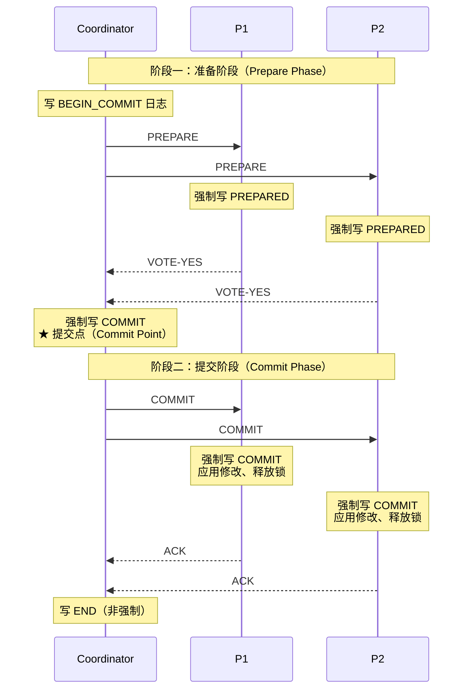
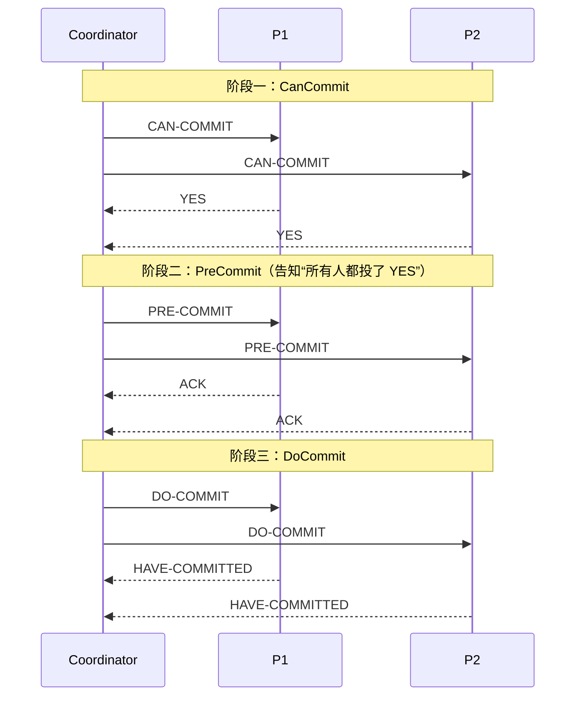
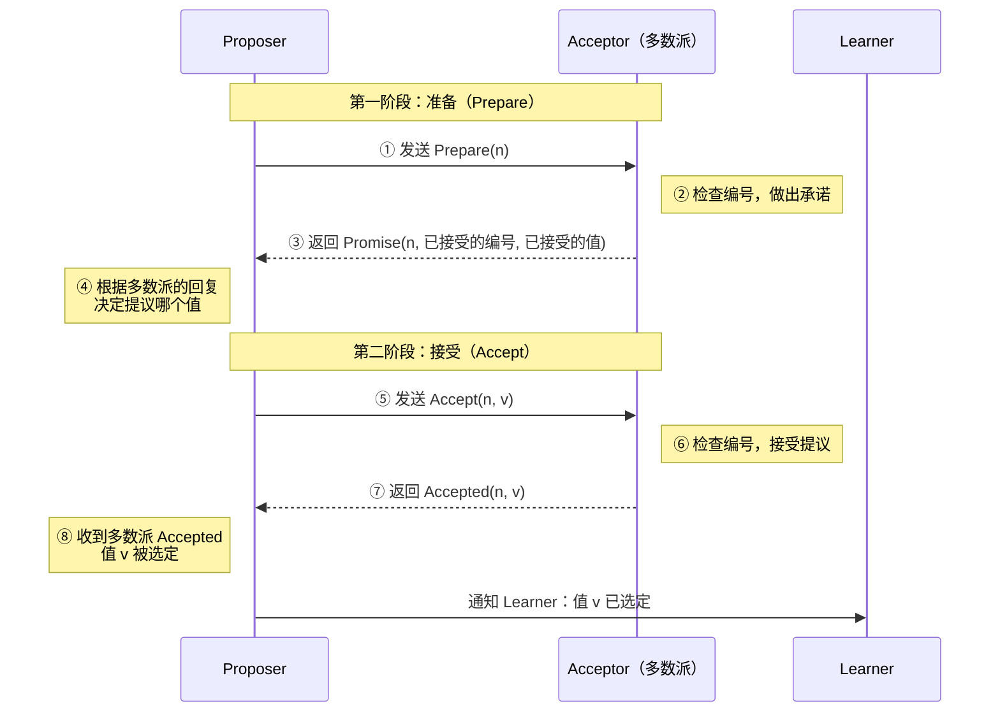
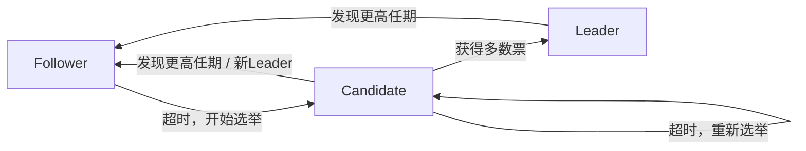
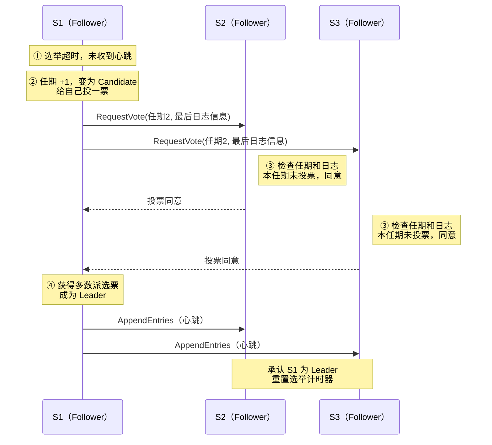
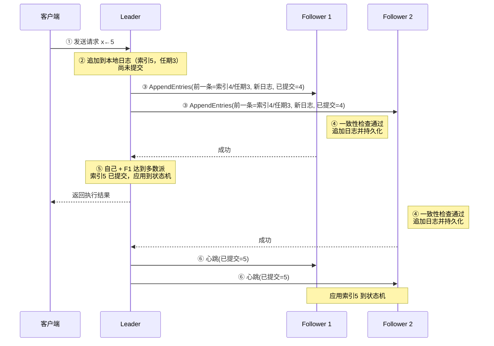

# 1. 一致性模型与共识

一致性协议是分布式系统中的核心机制，用于让多个节点（服务器）对某一数据或状态达成统一结果。

在单机系统中，数据只有一份，读写天然一致；但在分布式系统中，数据往往被复制到多台机器上以提高可用性和容错性，这就带来了"如何保证所有副本看起来像一份数据"的问题。一致性协议正是为解决这一问题而设计的规则集合。

分布式系统面临三大挑战：节点可能宕机、网络可能分区、消息可能丢失或延迟。如果没有一致性协议，不同节点上的数据副本可能产生分歧，导致用户读到旧数据、重复扣款、订单状态错乱等严重问题。一致性协议的目标就是在这些异常情况下，仍能让系统对外表现出正确、统一的行为。

在一组进程中，每个进程可以提议一个值，共识协议需要满足：

- **一致性（Agreement）**：所有正确进程决定相同的值。
- **有效性（Validity）**：被决定的值必须是某个进程提议过的值。
- **终止性（Termination）**：所有正确进程最终都会做出决定。

# 2. 理论基础

## 2.1 FLP 不可能性

1985 年 Fischer、Lynch、Paterson 证明：**在完全异步的系统中，只要有一个进程可能崩溃，就不存在能同时保证安全性和终止性的确定性共识算法。**

在异步模型中，消息延迟没有上界，因此无法区分“节点已崩溃”和“节点很慢”。协议总可能被调度到一个“犹豫不决”的状态并一直保持下去。

FLP 并不意味着共识无法实现，而是指出必须放松某些假设：

| 绕过方式     | 思路                                          | 代表                   |
| ------------ | --------------------------------------------- | ---------------------- |
| 部分同步模型 | 假设系统在某个未知时刻（GST）之后进入同步状态 | Paxos、Raft、PBFT      |
| 随机化       | 引入随机性，以概率 1 终止                     | Ben-Or、HoneyBadgerBFT |
| 故障检测器   | 引入不可靠的故障检测器抽象                    | Chandra-Toueg          |

## 2.2 CAP 与 PACELC

CAP 定理指出：网络分区（P）发生时，系统只能在一致性（C，指线性一致）与可用性（A）之间二选一。共识协议属于 **CP** 系统：分区时少数派一侧拒绝服务。

PACELC 进一步补充：**即使没有分区（Else），系统也要在延迟（L）与一致性（C）之间权衡**。共识协议每次写入至少需要一轮多数派往返，这是强一致性的固有延迟代价。

## 2.3 Quorum 与交集原理

几乎所有共识协议的安全性都建立在 **Quorum 交集**之上：

> 任意两个 Quorum 至少有一个公共节点。

对于 N 个节点，多数派 Quorum 大小为 ⌊N/2⌋+1。因此：

- 容忍 f 个崩溃故障需要 **2f+1** 个节点；
- 3 节点容忍 1 个故障，5 节点容忍 2 个故障；
- 偶数节点不会提高容错能力（4 节点仍只容忍 1 个故障），反而增加 Quorum 大小。

# 3. 原子提交协议

一个分布式事务需要修改分布在多个节点（数据库分片、不同的资源管理器）上的数据，但各节点只能保证本地操作的原子性。原子提交（Atomic Commitment Protocols）协议要解决的是：**让所有参与节点对事务的最终结果（提交或中止）达成一致，且结果尊重每个节点的意愿**——只要有一个节点无法提交（违反约束、死锁、磁盘满、崩溃），整个事务都必须中止。

原子提交解决的是“多个参与者要么全部提交、要么全部回滚”的问题，与共识密切相关但不等价：原子提交要求**所有**参与者同意，而共识只需**多数派**同意。

| 维度         | 原子提交（Atomic Commit）  | 共识（Consensus）        |
| ------------ | -------------------------- | ------------------------ |
| 输入         | 每个进程投 Yes / No        | 每个进程提议一个值       |
| 决定条件     | Commit 需要**全体**同意    | 多数派即可决定           |
| 单个进程故障 | 未投票的进程故障将导致中止 | 不影响（多数派存活即可） |
| 有效性       | 决定由所有投票共同约束     | 决定值是某个提议值       |

## 3.1 两阶段提交（2PC）

两阶段提交（2PC）由 Jim Gray（1978）和 Lampson 等人在 1970 年代末系统化，至今仍是分布式事务最基础的协议。

流程时序图：



**阶段一：投票阶段（Voting / Prepare Phase）**

1. 协调者向所有参与者发送 `PREPARE`。
2. 参与者检查自己能否提交：
   - 若可以：将事务的全部 redo/undo 信息及**锁信息**持久化，强制写 `PREPARED` 日志，然后回复 `VOTE-YES`。从这一刻起，参与者**放弃了单方面中止的权利**。
   - 若不可以：写 `ABORT` 日志，回复 `VOTE-NO`，并可立即单方面中止、释放资源。

**阶段二：决定阶段（Decision / Commit Phase）**

1. 协调者收集投票：
   - 全部 `YES`：强制写 `COMMIT` 日志，广播 `COMMIT`；
   - 任一 `NO` 或超时：写 `ABORT` 日志，广播 `ABORT`。
2. 参与者收到决定后，强制写对应日志，执行提交或回滚，释放锁，回复 `ACK`。
3. 协调者收到全部 `ACK` 后写 `END` 日志，此后可以清理该事务的状态（遗忘）。

**协调者的 `COMMIT` 日志成功落盘的那一刻，就是整个分布式事务的提交点。**

- 在此之前崩溃：恢复后可以安全地选择中止。
- 在此之后崩溃：恢复后必须继续推动提交。

这条原则贯穿所有原子提交协议的设计——理解一个协议，关键是找到它的“提交点”在哪里、由谁持久化。后文的 Percolator 和 Parallel Commits 本质上都是在**移动提交点的位置**。

## 3.2 三阶段提交（3PC）

三阶段提交（3PC）是在 2PC（两阶段提交）基础上改进的一种分布式事务提交协议，目的是缓解 2PC 的阻塞问题。

流程时序图：



流程分为三步：

1. **CanCommit**：协调者询问能否提交，参与者投票（与 2PC 第一阶段相同）。
2. **PreCommit**：所有人投 YES 后，协调者发送 PRE-COMMIT，传达“全体同意”这一**知识**。参与者记录并 ACK。若有人投 NO，直接发送 ABORT。
3. **DoCommit**：协调者收到全部 ACK 后发送 DO-COMMIT，参与者真正提交。

3PC 是在 2PC 基础上增加"预询问"阶段和超时机制的三阶段分布式事务协议，试图减少阻塞，但没能彻底解决一致性问题，实际使用不如 2PC 和 Raft 广泛。

# 4. 共识协议

## 4.1 Paxos

**Paxos** 是分布式系统中最经典的共识算法，由 Leslie Lamport 于 1990 年提出，他在论文 The Part-Time Parliament 中虚构了希腊 Paxos 岛上的一个议会：议员们经常离开议会（节点崩溃），信使传递消息可能延迟或丢失（不可靠网络），但议会仍需通过一致的法令（达成共识）。

Paxos 之后成为分布式共识的事实标准，被誉为分布式一致性的理论基石。它的核心目标是：**让一组节点在存在故障的情况下，对某个值达成一致**。

对于一组进程，各自可以提议一个值，需要让它们就“唯一一个值”达成一致。

安全性（Safety）要求：

1. **只有被提议的值才能被选定**（非平凡性）；
2. **只能选定一个值**（一致性）；
3. **进程不会认为某个值被选定了，除非它真的被选定了**（不会学到错误结果）。

活性（Liveness）目标：

- 最终总会有某个值被选定；
- 一旦值被选定，进程最终能学到它。

Paxos 的设计哲学是：**安全性在任何情况下都保证；活性只在系统足够稳定时保证**。

### 4.1.1 概念

在 Paxos 中，有三种角色，实际部署中，一个节点通常同时扮演三种角色。

| 角色                   | 职责                                         | 类比             |
| ---------------------- | -------------------------------------------- | ---------------- |
| **Proposer（提议者）** | 接收客户端请求，发起提案，推动协议进行       | 提出议案的议员   |
| **Acceptor（接受者）** | 对提案进行投票（承诺、接受），构成多数派     | 投票的议员       |
| **Learner（学习者）**  | 学习被选定的值，并据此执行（如应用到状态机） | 记录法令的书记员 |

Quorum（多数派）是指设 Acceptor 总数为 N，多数派为任意大小 ≥ ⌊N/2⌋+1 的 Acceptor 集合。一个值只要被**超过半数**的 Acceptor 接受，就算被“选定”。

| Acceptor 数量 N | 多数派大小 | 可容忍故障数 |
| --------------- | ---------- | ------------ |
| 3               | 2          | 1            |
| 5               | 3          | 2            |
| 7               | 4          | 3            |

每次提议都带有一个**提案编号 n**，不同的 Proposer 的编号是全局唯一的，编号越大，代表提议越“新”。

提案（Proposal）编号通过 `(轮次, 节点ID)` 的组合保证全局唯一性。

```
Proposal = (n, v)
  n: 提案编号（Proposal Number / Ballot），全局唯一，可比较大小
  v: 提案值（Value）
```

### 4.1.2 两阶段流程

第一阶段：准备阶段（Prepare）

**步骤 ①：Proposer 发送 Prepare 请求**

Proposer 生成一个比自己以前用过的都大的编号 n，向所有（至少多数派）Acceptor 发送 `Prepare(n)`。

注意：这个请求**只带编号，不带值**。它相当于在问：“我想用编号 n 发起提议，你们同意吗？另外，你们之前接受过什么值？”

**步骤 ②：Acceptor 处理 Prepare 请求**

Acceptor 比较 n 和自己承诺过的最大编号：

- **如果 n 更大**：更新自己的承诺编号为 n，并写入磁盘。这代表 Acceptor 做出了一个承诺：**以后不再接受任何编号小于 n 的提议**。
- **如果 n 不够大**：拒绝（可以直接忽略，也可以回复拒绝消息并告知自己承诺过的编号）。

**步骤 ③：Acceptor 回复 Promise**

如果同意，Acceptor 回复 `Promise`，同时**如实报告自己之前接受过的提议**（编号和值）；如果从未接受过任何提议，就报告“无”。

第一阶段让 Acceptor 拒绝更旧的提议，防止旧提议在之后“翻盘”，并且让 Proposer 了解之前是否已经有值可能被选定了。

中间步骤：决定提议哪个值

**步骤 ④：Proposer 选择要提议的值**

Proposer 收到**多数派**的 Promise 后，按以下规则决定值：

- **如果所有回复都表示“没有接受过任何值”**：Proposer 可以自由提议自己想要的值；
- **如果有回复报告了已接受的值**：Proposer **必须放弃自己的值**，改为提议这些回复中**编号最大**的那个已接受值。

因为 Proposer 无法判断那个值是否已经被选定。如果它已经被选定了，那么任何新提议都必须沿用它，否则就会出现两个不同的结果。既然无法判断，就采取最保守的做法：一律沿用。编号最大的提议是最新的，如果之前确实有值被选定，那么编号最大的已接受值一定就是那个值（或者与它相同）。

如果没有收到多数派的回复（被拒绝或超时），则等待一段随机时间后，用更大的编号重新开始第一阶段。

第二阶段：接受阶段（Accept）

**步骤 ⑤：Proposer 发送 Accept 请求**

Proposer 向 Acceptor 发送 `Accept(n, v)`，其中 n 是第一阶段使用的编号，v 是步骤 ④ 选出的值。

接收这个请求的 Acceptor 可以和第一阶段的不是同一批，只要达到多数派即可。

**步骤 ⑥：Acceptor 处理 Accept 请求**

Acceptor 检查编号：

- **如果 n 大于或等于自己承诺过的编号**：接受这个提议，把编号 n 和值 v 写入磁盘；
- **否则**：拒绝。这说明在此期间已经有更新的 Proposer 发起了 Prepare，当前提议已经过时。

注意这里是“**大于或等于**”：因为 Acceptor 在第一阶段承诺的正是编号 n，所以编号 n 的 Accept 应该被接受。

**步骤 ⑦：Acceptor 回复 Accepted**

接受后，Acceptor 回复 `Accepted(n, v)` 给 Proposer（也可以直接发给 Learner）。

**步骤 ⑧：值被选定**

当**多数派** Acceptor 接受了**同一编号**的提议时，值 v 就被正式选定，并且以后永远不会改变。

Proposer 收到多数派的 Accepted 后，就知道 v 已被选定，于是通知 Learner。如果没有收到多数派的 Accepted（被拒绝或超时），则用更大的编号从第一阶段重新开始。



### 4.1.3 活锁问题

如果两个 Proposer 不断用更大的编号互相抢占，可能出现以下情况：

```
P1 准备(1) 成功
→ P2 准备(2) 成功 → P1 接受(1) 被拒
→ P1 准备(3) 成功 → P2 接受(2) 被拒
→ P2 准备(4) 成功 → P1 接受(3) 被拒
→ ……
```

双方永远无法完成第二阶段。这种情况不会导致错误结果，但会导致**永远无法得出结果**。

**解决方法：**

1. **随机等待**：被拒绝后随机等待一段时间再重试，减少冲突；
2. **选出一个领导者（Leader）**：只允许 Leader 发起提议，从根本上避免竞争。

需要注意的是，即使短时间内出现两个 Leader，Paxos 也不会出错，只是可能暂时无法推进。Leader 只是为了提高效率，不影响正确性。

### 4.1.4 Multi-Paxos

日志的每个槽位都运行一次 Basic Paxos 代价太高（每条命令两轮 RTT）。Multi-Paxos 的优化：

- 选出稳定 Leader 后，Leader 对**所有未来槽位**一次性执行阶段 1；
- 之后每条命令只需执行阶段 2，即**一轮 RTT** 完成提交；
- 只有 Leader 变更时才需要重新执行阶段 1。

## 4.2 Raft

Raft 由 Diego Ongaro 与 John Ousterhout 于 2014 年提出，目标是“与 Multi-Paxos 等价，但更易理解”。它把问题拆分为**领导者选举、日志复制、安全性**三个子问题，并通过强 Leader 模型简化状态空间。

Raft 和 Paxos 解决的是同一个问题：**让多台机器对一串操作（日志）达成一致**。只要所有机器按相同顺序执行相同的操作，它们的数据就完全一致，这种方式称为**复制状态机**。

### 4.2.1 概念

**角色**

Raft 中的每个节点在任意时刻处于以下三种状态之一：

| 角色                    | 职责                                                 |
| ----------------------- | ---------------------------------------------------- |
| **Leader（领导者）**    | 处理所有客户端请求，向其他节点复制日志，定期发送心跳 |
| **Follower（跟随者）**  | 被动接收 Leader 的日志和心跳，响应投票请求           |
| **Candidate（候选人）** | 选举期间的临时状态，向其他节点拉票                   |

正常情况下，集群中只有 1 个 Leader，其余都是 Follower。



所有节点启动时都是 Follower，Follower 在一段时间内没有收到 Leader 的心跳，就认为 Leader 失效，转为 Candidate 发起选举。

Candidate 获得多数派选票后成为 Leader，Candidate 如果收到合法 Leader 的消息，或者发现更高的任期，就退回 Follower。如果选举超时仍未分出胜负，Candidate 开始新一轮选举。

Leader 一旦发现比自己更高的任期，说明已经有更新的 Leader，立即退回 Follower。

**任期**

Raft 把时间划分为一个个任期，用连续递增的整数编号。

- 每个任期以一次选举开始；
- 选举成功后，该 Leader 在整个任期内负责工作；
- 如果选举失败（例如票数被瓜分），这个任期没有 Leader，很快会进入下一个任期；
- 每个任期最多只有一个 Leader。

**消息**

Raft 只需要两种 RPC 消息：

| 消息                      | 发起者    | 作用                         |
| ------------------------- | --------- | ---------------------------- |
| RequestVote（请求投票）   | Candidate | 在选举中向其他节点拉票       |
| AppendEntries（追加日志） | Leader    | 复制日志；不带日志时作为心跳 |

### 4.2.2 领导者选举

**步骤 ①：触发选举**

每个 Follower 都有一个**选举超时时间**（例如 150~300 毫秒之间的**随机值**）。如果在这段时间内没有收到 Leader 的心跳，Follower 认为 Leader 已经失效，开始选举。

**步骤 ②：成为候选人**

节点执行以下动作：

- 把自己的任期号加 1；
- 转为 Candidate；
- 给自己投一票；
- 重置选举计时器；
- 向其他所有节点发送 `RequestVote` 请求，附带自己的任期号和最后一条日志的信息。

**步骤 ③：其他节点投票**

收到投票请求的节点按以下规则决定是否投票：

1. 如果候选人的任期**小于**自己的任期，拒绝；
2. 如果自己在这个任期内**已经投过票给别人**，拒绝（每个任期只能投一票，先到先得）；
3. 如果候选人的日志**不如自己新**，拒绝（这条规则保证了安全性，见第七节）；
4. 否则，投票给该候选人，并把投票记录写入磁盘。

**步骤 ④：统计选票，三种可能结果**

| 结果                                     | 处理                                                |
| ---------------------------------------- | --------------------------------------------------- |
| 获得多数派选票                           | 成为 Leader，立即向所有节点发送心跳，宣告自己的地位 |
| 收到其他节点的心跳，且对方任期不小于自己 | 承认对方是 Leader，退回 Follower                    |
| 超时仍未获得多数派（例如票数被瓜分）     | 任期加 1，开始新一轮选举                            |

选举流程时序图：



### 4.2.3 日志复制

每个节点都维护一份日志，每条日志包含三部分：

- **索引**：日志在序列中的位置；
- **任期**：这条日志被 Leader 创建时所在的任期；
- **命令**：要执行的具体操作。

**步骤 ①：客户端发送请求**

客户端把请求发给 Leader。如果发给了 Follower，Follower 会告诉客户端 Leader 是谁。

**步骤 ②：Leader 写入本地日志**

Leader 把命令作为一条新日志追加到自己的日志末尾（此时还**没有提交**，不能执行）。

**步骤 ③：Leader 并行发送给 Follower**

Leader 向所有 Follower 发送 `AppendEntries` 请求，内容包括：

- 新的日志条目；
- **前一条日志的索引和任期**（用于一致性检查）；
- Leader 当前已提交的位置。

**步骤 ④：Follower 检查并追加**

Follower 检查自己在“前一条日志的索引”位置上的日志，任期是否与 Leader 给出的一致：

- **一致**：说明之前的日志都相同，追加新日志，写入磁盘后回复成功；
- **不一致**：回复失败，等待 Leader 发送更早的日志。

**步骤 ⑤：多数派确认，提交日志**

Leader 收到**多数派**（包括自己）的成功回复后，这条日志就被**提交（Committed）**。Leader 把它应用到状态机，并把执行结果返回给客户端。

**步骤 ⑥：通知 Follower 提交**

Leader 在后续的 `AppendEntries`（包括心跳）中带上最新的提交位置。Follower 得知后，也把这些日志应用到自己的状态机。



### 4.2.4 安全性

前面的选举和复制机制还不足以保证正确性。Raft 额外增加了两条关键规则。

**规则一：选举限制——只有日志最新的节点才能当选**

如果一个日志落后的节点当选 Leader，它会用自己的日志覆盖其他节点，可能导致已经提交的日志被删除。解决方案是投票时，节点只投给日志至少和自己一样新的候选人。

已提交的日志一定存在于多数派节点上，候选人要当选，也必须获得多数派的选票，两个多数派必然有交集，交集中的节点拥有该已提交日志，如果候选人缺少这条日志，交集节点就会拒绝投票，它就无法当选。因此，新 Leader 一定包含所有已提交的日志。

**规则二：Leader 只能通过“计数”提交本任期的日志**

一条旧任期的日志，即使已经被复制到多数派，也不能直接认为已经提交，否则可能被后来的 Leader 覆盖。

Leader 只通过计数副本来提交当前任期的日志；旧任期日志随当前任期日志的提交而被间接提交。因此新 Leader 上任后通常会立即追加一条 no-op 日志，以尽快提交之前的所有日志，也为线性一致读提供前提。

## 4.3 ZAB

ZAB 是 ZooKeeper 的原子广播协议，设计目标是主备系统中的有序状态变更广播，特别强调 主序（Primary Order）：同一 Leader 发出的事务按序交付，且新 Leader 必须先交付前任所有已提交事务。

**事务 ID（zxid）**：64 位，高 32 位为 epoch（类似任期），低 32 位为计数器。

**协议阶段：**

1. **发现（Discovery）**：选出准 Leader，收集 Follower 的最新 epoch，确定新 epoch。
2. **同步（Synchronization）**：准 Leader 将拥有最大 zxid 的历史同步给 Follower（DIFF / TRUNC / SNAP 三种方式），多数派确认后成为正式 Leader。
3. **广播（Broadcast）**：类似两阶段的 Proposal → ACK → Commit 流程，多数派 ACK 即提交。

## 4.4 拜占庭容错

拜占庭容错（Byzantine Fault Tolerance, BFT） 是指分布式系统在存在恶意节点的情况下，仍能保证系统正确运行、达成共识的能力。它主要用于联盟链、区块链等对信任要求极高、需要防范节点作恶的场景。

前面的协议都假设崩溃故障（Crash Fault）：节点要么正常工作，要么停止。拜占庭故障允许节点任意行为：撒谎、伪造消息、合谋。这在区块链、跨组织系统中是必要的假设。

与崩溃容错（CFT）的区别：

| 类型              | 故障假设                    | 代表协议                   | 节点要求 |
| :---------------- | :-------------------------- | :------------------------- | :------- |
| 崩溃容错（CFT）   | 节点只会宕机/失联，不会撒谎 | Paxos、Raft、ZAB           | 2f+1     |
| 拜占庭容错（BFT） | 节点可能任意作恶、撒谎      | PBFT、HotStuff、Tendermint | 3f+1     |

PBFT（Practical Byzantine Fault Tolerance）是第一个实用的 BFT 算法，核心流程：

1. **预准备（Pre-Prepare）**：主节点收到请求后，分配序号并广播给其他节点。
2. **准备（Prepare）**：各节点收到后，向所有节点广播 Prepare 消息，确认序号和内容一致。
3. **提交（Commit）**：当节点收到足够多的 Prepare 确认后，广播 Commit 消息。
4. **回复（Reply）**：当节点收到足够多的 Commit 确认后，执行请求并回复客户端。

客户端只要收到 f+1 个相同结果，就能确认该结果是正确的，因为恶意节点最多 f 个，不可能伪造出 f+1 个一致的结果。

# 5. 协议对比

| 协议        | 故障模型     | 容错节点比   | 常规提交延迟         | 消息复杂度 | 可理解性 | 代表系统                   |
| ----------- | ------------ | ------------ | -------------------- | ---------- | -------- | -------------------------- |
| 2PC         | 崩溃（阻塞） | 不容错协调者 | 2 RTT                | O(n)       | 高       | XA 事务                    |
| Multi-Paxos | 崩溃         | 2f+1         | 1 RTT                | O(n)       | 低       | Chubby、Spanner            |
| Raft        | 崩溃         | 2f+1         | 1 RTT                | O(n)       | 高       | etcd、Consul、TiKV         |
| ZAB         | 崩溃         | 2f+1         | 1 RTT                | O(n)       | 中       | ZooKeeper                  |
| EPaxos      | 崩溃         | 2f+1         | 1 RTT（无冲突）      | O(n)       | 很低     | 研究系统                   |
| PBFT        | 拜占庭       | 3f+1         | 3 轮                 | O(n²)      | 中       | Hyperledger Fabric（早期） |
| HotStuff    | 拜占庭       | 3f+1         | 3 轮（链式可流水线） | O(n)       | 中       | DiemBFT                    |

选型建议：

- **构建元数据服务、配置中心、分布式锁**：直接使用 etcd / ZooKeeper，而非自研协议。
- **自研存储系统**：优先选择 Raft，生态成熟（etcd/raft、hashicorp/raft、braft、openraft 等库）。
- **跨地域、写入分布均匀、冲突少**：可考虑 EPaxos 类无 Leader 协议，但需评估实现复杂度。
- **参与方互不信任**：选择 BFT 协议，节点数较多时优先 HotStuff 系。
- **只需最终一致、追求极致可用性**：考虑 Gossip + CRDT，而非共识协议。

