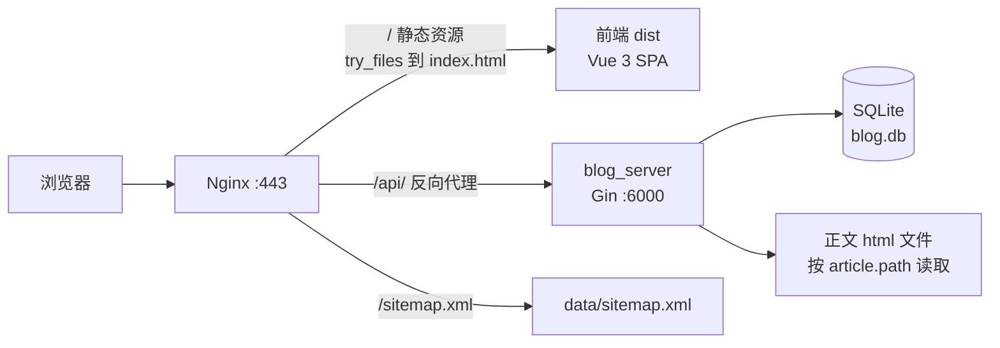
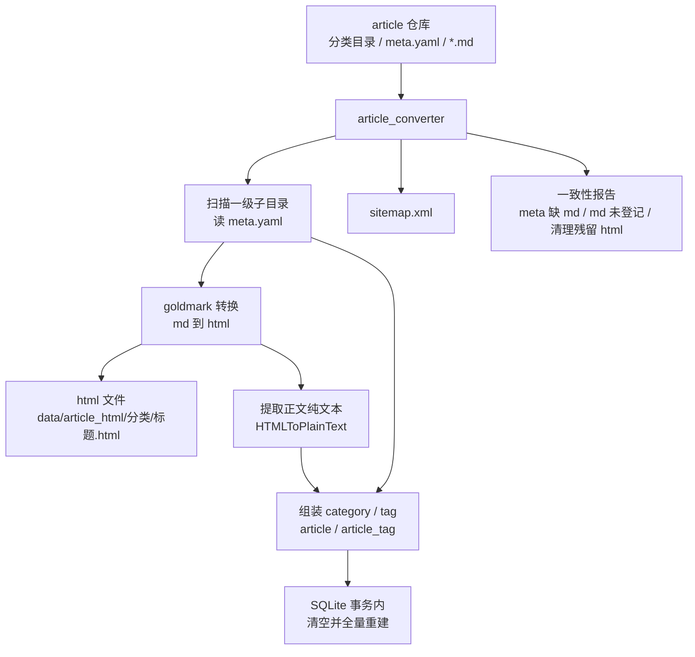
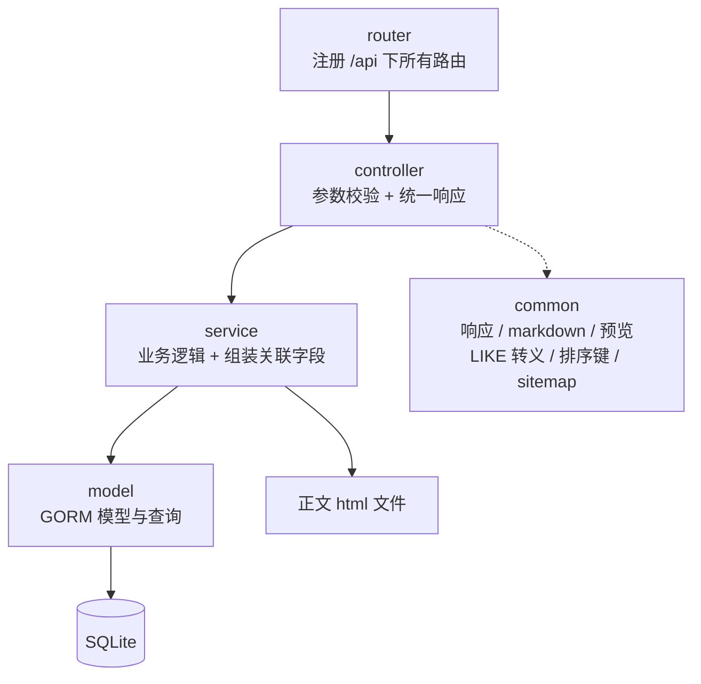
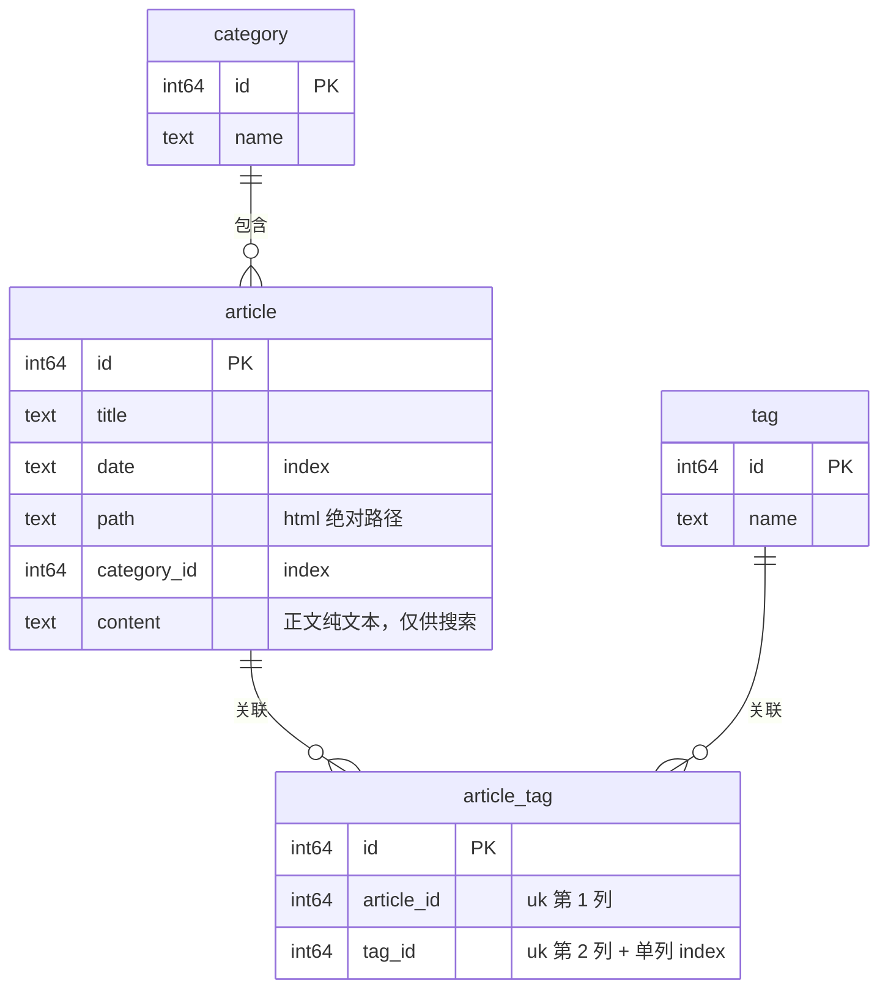

# 1. 从旧版到新版

## 1.1 旧版博客的设计

旧版博客仓库：https://github.com/huanglianjing/huanglianjing.com

旧版博客是一个典型的 Hugo 静态站点：

* **框架**：Hugo + [PaperMod](https://github.com/adityatelange/hugo-PaperMod) 主题，主题以 git submodule 引入，需要改动的地方把 `layouts/` 下的模板文件拷到自己仓库里覆盖。
* **内容**：全部文章平铺在 `content/posts/` 下，分类和标签写在每篇文章开头的 front matter 里：

```yaml
---
title: "Go基础语法"
date: 2021-06-30T02:02:30+08:00
draft: false
showToc: true
TocOpen: true
categories: ["Go"]
tags: ["Go"]
---
```

* **构建产物**：`hugo` 命令把 markdown 全站渲染成静态 HTML，输出到 `public/`，上传到服务器由 Nginx 直接作为静态文件托管。
* **搜索**：Hugo 额外输出一个 `index.json`，里面是**每篇文章的标题、摘要、链接和全文纯文本**，浏览器打开搜索页时整份下载，用 Fuse.js 在前端做模糊匹配。
* **配置**：`hugo.yaml` 一个文件管所有东西——菜单、首页 profile、favicon、备案号、目录开关、i18n 语言列表等。

用了几年下来，主要的痛点有这些：

1. **内容和站点代码耦合在一个仓库**。文章、主题、配置、构建产物混在一起，`git log` 里大量提交都是「更新文章」，改样式和写文章的历史互相淹没。
2. **定制受主题摆布**。想改一点样式或结构，就得把 PaperMod 的 partial 拷过来改；主题一升级，被覆盖的模板就可能和上游对不上（`hugo 升级 v0.128.0 配置修改` 这条提交就是在处理这类问题）。整个仓库里躺着 30 多个从主题拷来的 partial 和 20 多个 shortcode，其中绝大多数我根本用不到（`douban`、`bilibili`、`youtube`、`photoswipe`……），还有 33 个语言的 i18n 文件——而站点只有中文。
3. **搜索方案很浪费**。全文索引整份塞给浏览器：随着文章变多，`index.json` 会一直涨，而且是**首次进搜索页就下载全量**。Fuse.js 的模糊匹配对中文并不友好，阈值稍松就出一堆不相关结果，而且只能给出一个混在一起的结果列表，没法区分「命中的是分类、标签、标题还是正文」。
4. **改一个字要全站重建**。Hugo 的构建虽快，但产物是整个 `public/` 目录，部署就是把几十兆的静态站重新同步一遍；任何模板改动都要全站重渲染。
5. **动态能力为零**。纯静态站没有服务端，想加任何需要查询、统计、聚合的能力（比如按命中类型分组的搜索、访问统计、动态聚合页），只能靠第三方服务或往前端塞更多索引文件。
6. **前端能力被模板框住**。想做主题切换的圆形扩散动画、顶栏面包屑打字机效果、mermaid 按需渲染这些交互，在 Go template + 主题 JS 的组合里写起来非常别扭。

## 1.2 重构原因及内容

重写的核心动机不是「Hugo 不好用」，而是：**我想要一个自己完全掌握的博客系统**——前端交互随便改，后端有真实的查询能力，内容和代码彻底分离，顺便也是一个可以持续折腾的练手项目（Go + Gin + GORM + Vue 3 正好都是想深入的技术栈）。

新版（本仓库）的设计与改进：

| 维度     | 旧版（Hugo + PaperMod）                      | 新版（Go + Vue 3）                                           |
| :------- | :------------------------------------------- | :----------------------------------------------------------- |
| 内容存放 | 站点仓库内的 `content/posts/`                | **独立的 `article` 内容仓库**，21 个分类目录 + 每目录一个 `meta.yaml` |
| 元信息   | 每篇文章的 front matter                      | 每个分类目录一份 `meta.yaml`，集中登记标题 / 日期 / 标签     |
| 渲染方式 | 全站静态渲染成 HTML 页面                     | **离线把 md 转成正文 HTML 片段 + 写入 SQLite**，页面由前端 SPA 组装 |
| 前端     | 主题模板 + 覆盖 partial                      | 自己写的 Vue 3 SPA，无主题依赖                               |
| 搜索     | 客户端下载 1.3 MB 全文索引，Fuse.js 模糊匹配 | 服务端 SQL 子串匹配，**分类 / 标签 / 标题 / 正文四类分组**返回，带命中片段和前端高亮 |
| 部署产物 | 27 MB 静态站全量同步                         | 一个静态二进制 + 前端 `dist` + SQLite 文件，改文章只需重跑转换工具 |
| 定制成本 | 受主题结构约束                               | 全部代码自己的，改哪都行                                     |
| 依赖体积 | 主题 submodule + 33 份 i18n + 20+ shortcode  | 后端 7 个直接依赖，前端 4 个运行时依赖                       |

同时也要诚实地记下**这次重写的代价**：

- 旧版是纯静态站，每个 URL 都有完整 HTML，对搜索引擎最友好；新版是 SPA，首屏 HTML 里没有正文，SEO 上是**倒退**的（目前靠离线生成的 `sitemap.xml` 补一部分，见 5.5 与第 6 节的预渲染计划）。
- 旧版 `hugo` 一条命令搞定；新版多了「转换 → 写库 → 部署」的流水线和一个常驻服务进程，运维面变大了。
- 旧版免费带的功能（RSS、阅读时长、字数统计、归档页、图片灯箱）现在都得自己写，第一版先没做。

# 2. 系统架构

## 2.1 整体架构

新版博客仓库：https://github.com/huanglianjing/blog

文章仓库（已有）：https://github.com/huanglianjing/article

新版博客实现了前后端分离，保存在同一个仓库中，有更高的灵活性，给后续功能开发迭代提供更高的自由度。

同时还将博客的逻辑和文章内容进行分仓库的隔离，实现了博客功能发布更新和文章更新的隔离。

**仓库与组件**

整套东西分成两个仓库、三个可执行部分：

- **`article` 仓库**（内容）：一级子目录即分类，目录内是 `.md` 文章和一份 `meta.yaml`。
- **`blog` 仓库**（代码，即本仓库）：
  - `server/cmd/article_converter`：离线转换工具，把 md 变成 HTML 并全量重建数据库，顺带生成 `sitemap.xml`。
  - `server/cmd/blog_server`：HTTP 服务（Gin），只提供 `/api` 下的 JSON 接口。
  - `web/`：Vue 3 + Vite 前端，构建成静态 `dist`。

关键设计是**内容不在运行时渲染 markdown**，而是离线预生成：文章的正文 HTML 是文件，元信息（分类 / 标签 / 标题 / 日期 / 正文纯文本）在 SQLite 里。服务端只做查询和文件读取，不碰 markdown。

**技术选型**

| 层       | 选型                                                         | 说明                                                     |
| :------- | :----------------------------------------------------------- | :------------------------------------------------------- |
| 后端语言 | Go 1.25                                                      | 单静态二进制，部署简单                                   |
| Web 框架 | Gin                                                          | 只用到路由和 JSON 返回                                   |
| ORM      | GORM                                                         | 表结构由 struct tag 声明，`AutoMigrate` 建表             |
| 数据库   | SQLite（`glebarez/sqlite` + `modernc.org/sqlite`）           | **纯 Go 驱动**，`CGO_ENABLED=0` 即可交叉编译出静态二进制 |
| markdown | goldmark（GFM + 脚注 + 标题锚点）                            | 只生成结构化 HTML，外观交给前端                          |
| 其他     | `goccy/go-yaml`、`mozillazg/go-pinyin`、`golang.org/x/net/html` | 解析 meta、标签拼音排序、HTML 提取纯文本                 |
| 前端     | Vue 3 + Vite 6 + vue-router 4                                | 组合式 API，无 UI 框架，样式全手写                       |
| 前端增强 | highlight.js、mermaid                                        | 都是懒加载，不进首屏                                     |

## 2.2 前端设计

前端是一个纯手写的 Vue 3 SPA：9 个页面路由（外加 404 兜底）、5 个复用组件、一份全局样式，没有 UI 框架。整体浅色基调、内容区固定 800px（文章页 1100px，因为右侧有目录），全站做了移动端适配。

**页面与路由**

| 路由               | 页面             | 数据来源                 |
| :----------------- | :--------------- | :----------------------- |
| `/`                | 首页（最近文章） | `/api/article/recent`    |
| `/article`         | 文章列表         | `/api/article/list`      |
| `/article/:title`  | 文章详情         | `/api/article/detail`    |
| `/category`        | 分类总览         | `/api/category/overview` |
| `/category/:name`  | 某分类下的文章   | `/api/category/list`     |
| `/tag`             | 标签云           | `/api/tag/overview`      |
| `/tag/:name`       | 某标签下的文章   | `/api/tag/list`          |
| `/search?q=`       | 搜索结果概览     | `/api/search/overview`   |
| `/search/:type?q=` | 某一类的完整结果 | `/api/search/list`       |
| 其它               | 404              | —                        |

顶栏（`TopBar`）全站常驻：左侧站点名 + 面包屑，右侧「文章 / 分类 / 标签」导航、主题切换按钮、可展开的搜索框。

**页面介绍**

首页目前只有一个「最近文章」模块（取最近 5 篇，接口 `/api/article/recent`），右上角「更多」进文章列表页。


文章列表页将全部文章分页展示，每页 10 条，按日期倒序。底部是数字分页组件。


正文（服务端返回的 HTML）+ 右侧固定目录 + 右下角回到顶部按钮。正文页支持代码块语法高亮、mermaid 图、目录、图片懒加载等特性。


分类页是列表，每项后面跟文章数，按文章数降序；点进去是该分类下的文章分页列表。


标签页是**标签云**：按文章数分 5 档字号（<5 / 5+ / 10+ / 20+ / 40+），窄屏下大档位字号会收一收，免得一个标签占满一行。排序规则是数字 → 字母 → 汉字，字母不分大小写，汉字按拼音排序。


搜索结果按**分类 / 标签 / 标题 / 正文**四类分组展示，每类最多 5 条并显示命中总数，超过 5 条给「更多」入口进到该类的完整结果页。分类和标签类一次返回全部，标题和正文类分页。

正文命中的文章会展示**命中处的上下文片段**（命中位置前留 30 字、整段 120 字，两端补省略号），只有标题命中的则回落到文章摘要。


**交互细节**

除了基本的文章排列和展示，还设计了一些交互细节：

* **顶栏面包屑的打字机效果**。顶栏左侧固定站点名，后面跟着当前位置的面包屑，切换路由时不是直接替换，而是**先逐字退回到与新面包屑的公共前缀，再逐字打出剩下的部分**，末尾带一个只在动画期间出现的光标。
* **主题切换的圆形扩散**。切换时新主题**以按钮中心为圆心扩散覆盖**旧主题。

## 2.3 后端设计

**请求路径**



- 前端是 SPA，路由由 `vue-router` 的 history 模式接管，Nginx 用 `try_files $uri $uri/ /index.html` 兜底。
- 接口统一挂在 `/api` 前缀下，避免和前端路由（`/article`、`/article/:title`）撞车。
- 文章详情请求时，服务端先按标题查库拿到 `path`，再读那个 HTML 文件返回，正文不进数据库（进库的只有搜索用的纯文本）。

**文章转化流程**



**代码分层**

controller 只做参数校验和响应，业务逻辑在 service，SQL / GORM 查询在 model。



**数据库设计**

包含四张表，由 GORM 的 struct tag 声明并使用 `AutoMigrate` 建出来。



# 3. 开发与部署

## 3.1 本地开发

后端和转换工具由 `make dev` 一起搞定：它把两个二进制编译到 `blog_dev/`，然后立刻跑一遍转换（源目录取仓库同级的 `../article`），产物落在 `data/` 下。

```bash
# 1. 编译后端程序并转换文章
make dev

# 2. 启动后端服务（默认 6000 端口）
cd blog_dev && ./blog_server

# 3. 启动前端开发服务器
cd web && npm install && npm run dev

# 4. 打开 http://localhost:5173/
```

前端 dev 服务器靠 `web/vite.config.js` 里的 proxy 把 `/api` 转发到 `localhost:6000`。**新增接口路径时要记得同步登记**，否则请求会被前端的 SPA 路由拦下来。

改动的验证方式：后端 `cd server && go build ./...`，前端 `cd web && npm run build`，接口行为改动用 `curl` 打一遍对应路径。

## 3.2 发布部署

`make release` 交叉编译后端（默认 `linux/amd64`，`CGO_ENABLED=0`）、构建前端 `dist`，一起打成 `blog.tar.gz`：

```
blog/
├── blog_server         # 后端服务
├── article_converter   # 转换工具
├── config/config.yaml
└── dist/               # 前端静态文件
```

服务器上解压后重启服务即可：

```bash
tar --warning=no-unknown-keyword -zxf blog.tar.gz
systemctl restart blog_server
```

后端以 **systemd 服务**运行（`/etc/systemd/system/blog_server.service`），拿到开机自启、崩溃重启和 journal 日志；Nginx 负责 HTTPS 终结、静态文件托管、`/api` 反向代理和 `/sitemap.xml` 的 alias。完整的单元文件、Nginx 配置和 SSL 证书更新步骤见仓库 README.md。

## 3.3 文章部署

代码和内容的发布是**互相独立**的：改文章不需要重新发布代码，反之也一样。

```bash
# 打包内容仓库并上传
tar --exclude=article/.git -zcf article.tar.gz article

# 服务器上解压后重跑转换：写 html、重建数据库、更新 sitemap
./blog/article_converter -src article -db data/db/blog.db -out data/article_html \
    -sitemap data/sitemap.xml -c blog/config/config.yaml
```

转换完成即生效，**不需要重启后端服务**（服务只是在请求时读库和读文件）。数据文件放在 `blog/` 之外的 `data/` 目录，所以重新解压代码包不会碰到数据库和文章 HTML。

# 4. 后续规划

产品规划：

* 首页重新设计，展示个人项目、自我介绍和各平台联系方式；
* 顶部栏加入项目、工具两个模块；
* 网站风格和体验调整；

技术规划：

* 一键部署脚本，将打包、上传、解压、重启做到一次执行完成，无需手动多部操作；
* SQLite FTS5 全文索引 + 中文分词，替换现在的 LIKE 子串匹配；
* 接口缓存，分类 / 标签概览这类结果换存在内存，并考虑好刷新机制；

