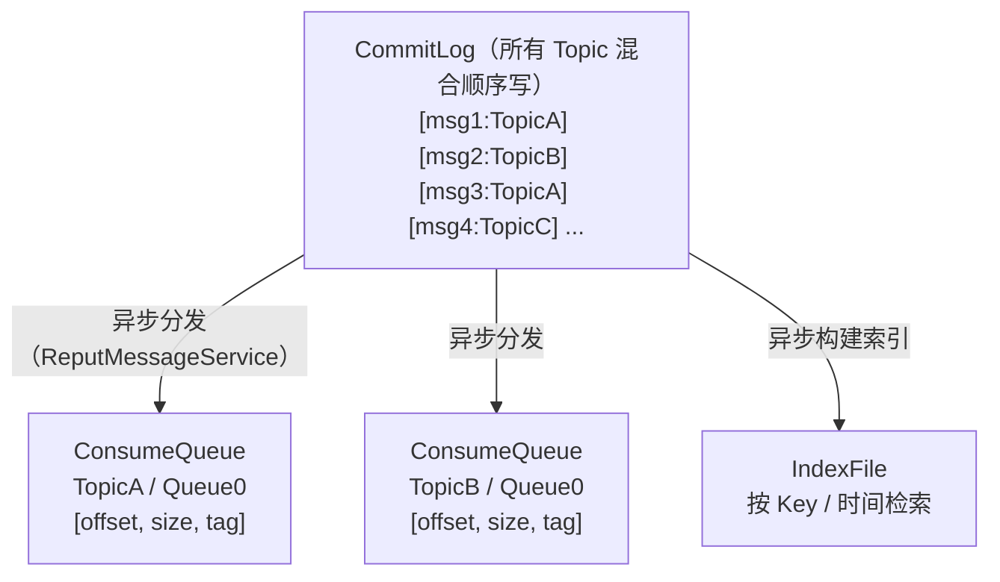

# 1. 引言

消息队列（Message Queue，MQ）是分布式系统中的基础中间件。

最核心的三大作用可以概括为：**解耦、异步、削峰**。具体有以下几种：

| 作用              | 说明                                   | 典型场景                     |
| ----------------- | -------------------------------------- | ---------------------------- |
| **系统解耦**      | 生产者与消费者互不感知，独立演进       | 订单系统通知库存、物流、财务 |
| **异步处理**      | 将非核心流程异步化，缩短主链路响应时间 | 下单后异步发短信、发积分     |
| **流量削峰**      | 用队列缓冲突发流量，保护下游系统       | 秒杀、大促                   |
| **数据分发/广播** | 一份数据被多个系统订阅                 | 数据变更同步（CDC）          |
| **最终一致性**    | 借助可靠消息实现分布式事务             | 跨服务的转账、支付           |
| **流式数据管道**  | 作为实时数据总线                       | 日志采集、埋点、实时数仓     |

核心概念：

- **Producer（生产者）**：发送消息的一方。
- **Consumer（消费者）**：接收并处理消息的一方。
- **Broker**：消息服务器节点，负责存储和转发消息。
- **Topic（主题）**：消息的逻辑分类。
- **Partition / Queue（分区/队列）**：Topic 的物理分片，是并行度和顺序性的基本单位。
- **Consumer Group（消费组）**：一组消费者共同消费一个 Topic，组内负载均衡，组间广播。
- **Offset（位点）**：消息在分区中的位置标识。

消息队列主要有两大流派：

- **传统消息队列（Message Queue）**：以“队列”为中心，消息被消费确认后即删除，强调路由、灵活投递、单条消息的可靠处理。代表：RabbitMQ。
- **日志型/流式平台（Log-based Streaming）**：以“只追加日志”为中心，消息消费后不删除、可重复回溯，强调吞吐和数据持久化。代表：Kafka。

RocketMQ 和 Pulsar 则在一定程度上融合了这两种模型。

# 2. Kafka


Kafka 由 LinkedIn 于 2010 年前后开发，2011 年开源，2012 年成为 Apache 顶级项目，使用 Scala 和 Java 编写。最初用于解决 LinkedIn 海量日志与活动流数据的采集和传输问题，现已发展为**分布式事件流平台（Event Streaming Platform）**，是大数据与实时计算领域的事实标准。

**系统架构**

Kafka 架构如下，早期版本依赖 ZooKeeper 进行元数据管理，到了 4.0 版本已彻底移除 ZooKeeper，只支持 KRaft。


核心组件：

- **Broker**：存储消息的服务节点。
- **Topic / Partition**：Topic 被划分为多个 Partition，每个 Partition 是一个有序、不可变、只追加的日志。
- **Replica**：每个 Partition 有多个副本，其中一个为 Leader，负责读写；其余为 Follower，从 Leader 拉取数据同步。
- **ISR（In-Sync Replicas）**：与 Leader 保持同步的副本集合，Leader 故障时只从 ISR 中选举新 Leader。

**存储设计**

Kafka 的高吞吐主要来自其存储设计：

```
topic-partition-0/
├── 00000000000000000000.log        # 消息数据（Segment）
├── 00000000000000000000.index      # 稀疏偏移量索引
├── 00000000000000000000.timeindex  # 时间戳索引
├── 00000000000000368769.log
├── 00000000000000368769.index
└── ...
```

1. **分区日志 + 顺序写**：每个 Partition 对应一个目录，数据按 Segment 文件切分，只追加写入，磁盘顺序写速度接近内存随机写。
2. **稀疏索引**：每隔一定字节建一条索引，通过二分查找定位后顺序扫描，索引文件小，可常驻内存。
3. **Page Cache**：Kafka 不在 JVM 堆中缓存消息，而是依赖操作系统页缓存，避免 GC 压力，Broker 重启后缓存仍可能有效。
4. **零拷贝（Zero-Copy）**：消费时通过 `sendfile` 将数据从页缓存直接发送到网卡，省去用户态拷贝。
5. **批量与压缩**：Producer 端批量发送（`batch.size`、`linger.ms`），支持 gzip、snappy、lz4、zstd 压缩，以批为单位存储和传输。

**生产与消费**

Producer 端通过 `acks` 参数来控制可靠性：0 表示无需确认，1 只需要 Leader 写入即确认，all(-1) 要求 ISR 中所有副本写入才确认。

Exactly Once 语义实现方式：

* **幂等 Producer**：通过 `PID + Sequence Number` 对单分区、单会话的消息去重。
* **事务**：通过 `transactional.id` 实现跨分区原子写入，配合消费者 `isolation.level=read_committed`，可在 “consume-transform-produce” 场景（如 Kafka Streams）实现端到端精确一次。

消费模型：

- **Pull 模式**：消费者主动拉取，自行控制消费速率。
- **Consumer Group**：一个 Partition 在同一时刻只能被组内一个消费者消费，因此**消费并行度上限 = 分区数**。
- **Offset 管理**：位点存储在内部 Topic `__consumer_offsets` 中，可随时重置位点实现**消息回溯**。
- **Rebalance**：消费者加入/退出时触发分区重分配。传统的 Eager 协议会造成全组 “Stop The World”；后续引入了 Cooperative Sticky 增量重平衡，以及 KIP-848 新一代消费组协议（由服务端协调，Kafka 4.0 GA），显著改善了重平衡问题。
- **Share Group（KIP-932，Queues for Kafka）**：Kafka 4.0 起提供早期预览，支持多个消费者并发消费同一分区并逐条确认，补齐“传统队列”语义。

**技术评价**

优点：

- 吞吐量极高，单集群可达每秒百万级甚至更高的消息量；
- 持久化与回溯能力强，可作为长期事件存储；
- 生态最为完善，大数据领域事实标准；
- 社区活跃，资料丰富，云厂商托管服务成熟。

缺点：

- **分区数敏感**：每个分区对应独立的文件，单机分区数过多时，顺序写退化为随机写，性能下降；
- **缺少业务型特性**：原生不支持延迟消息、消息级重试、死信队列（需要业务或框架自行实现）、按 Tag 过滤等；
- **扩容需要数据迁移**：新增 Broker 后需手动执行分区重分配，迁移大量数据耗时且影响性能；
- 消费并行度受分区数限制（Share Group 成熟前）。

Kafka 的适用场景有日志采集、用户行为埋点、实时数仓、CDC 数据同步、流式计算的数据源、事件溯源（Event Sourcing）、指标监控数据管道。

# 3. RocketMQ


RocketMQ 源自阿里巴巴，前身为 Notify 和 MetaQ（借鉴了 Kafka 的设计思想），使用 Java 编写，2016 年捐献给 Apache 基金会，2017 年成为顶级项目。它经历了多年“双十一”的考验，专为**金融级、电商级业务消息**场景设计，在国内互联网公司中应用广泛。

**系统架构**

RocketMQ 技术架构如下：


核心组件：

- **NameServer**：轻量级路由注册中心，节点之间无状态、互不通信，替代了 ZooKeeper，简化了部署。
- **Broker**：存储与转发消息，分为 Master 与 Slave。
- **Producer / Consumer**：从 NameServer 获取路由，直连 Broker。

**存储模型**

RocketMQ 与 Kafka 最本质的区别在于存储结构：



- **CommitLog**：单个 Broker 上所有 Topic 的消息顺序写入同一组文件（默认每个 1GB），保证了**写入始终是纯顺序写**。
- **ConsumeQueue**：每个 Topic 的每个队列一个逻辑索引文件，每条记录固定 20 字节（CommitLog 偏移量 8B + 消息大小 4B + Tag HashCode 8B），用于快速定位。
- **IndexFile**：基于哈希的索引，支持按消息 Key 或时间范围查询消息。
- 通过 **mmap** 内存映射读写文件，支持同步刷盘与异步刷盘。

即使 Topic 和队列数量很多，写入仍是单文件顺序写，对大量 Topic 的支持远好于 Kafka。但带来的代价是读取时需要先读 ConsumeQueue 再随机读 CommitLog，读性能依赖页缓存命中率。

**核心特性**

RocketMQ 的最大优势在于面向业务场景的丰富功能：

* **事务消息（分布式事务）**：基于“半消息 + 本地事务 + 事务回查”机制，实现本地事务与消息发送的最终一致性；
* **延迟/定时消息**：支持固定的延迟级别和任意时间点的定时消息；
* **消费重试与死信队列**：消费失败自动进入重试队列（`%RETRY%ConsumerGroup`），按梯度延迟重试，超过次数进入死信队列（`%DLQ%ConsumerGroup`），便于人工处理；
* **消息轨迹与查询**：支持按 Message ID、Key 查询消息，支持消息轨迹追踪，排障非常方便；
* **消费模式**：集群消费（组内负载均衡）与广播消费（每个消费者都收到全量消息）；
* **高可用**：同步复制（SYNC_MASTER）保证主从数据一致，支持同步刷盘（SYNC_FLUSH）与异步刷盘（ASYNC_FLUSH），基于 Raft 实现自动选主与故障切换；

**技术评价**

优点：

- 业务功能最丰富：事务消息、定时消息、重试、死信、过滤、轨迹、查询一应俱全；
- 支持海量 Topic，单机支持上万 Topic 依旧性能稳定；
- 低延迟、高可靠，经过阿里“双十一”超大规模验证；
- Java 编写，国内社区和中文资料丰富，便于二次开发和问题排查。

缺点：

- 多语言客户端早期成熟度不足（5.x gRPC SDK 正在改善）；
- 国际化生态与大数据生态集成程度不及 Kafka；
- 不支持 AMQP、MQTT 等标准协议的原生支持（有 MQTT 等扩展项目）；
- 4.x 版本主从切换能力较弱，需使用 DLedger 或升级 5.x。

RocketMQ 的适用场景有电商交易、订单、支付、金融业务、分布式事务、定时任务、业务异步解耦、需要大量 Topic 的业务消息平台。

# 4. RabbitMQ


RabbitMQ 于 2007 年发布，使用 Erlang 语言编写（Erlang 天生擅长高并发、分布式与容错），它是传统企业级消息队列的代表，以**灵活的路由、成熟稳定、多协议支持**著称。

**系统架构**

RabbitMQ 系统架构如下：


核心概念：

- **Connection / Channel**：TCP 连接上复用多个轻量级 Channel。
- **Virtual Host**：逻辑隔离单元，类似命名空间，实现多租户。
- **Exchange（交换机）**：接收生产者消息，根据规则路由到队列。**生产者不直接向队列发消息**。
- **Queue（队列）**：存储消息，消费者从队列获取消息。
- **Binding**：Exchange 与 Queue 之间的绑定规则。

Exchange 交换机支持点对点、广播、按通配符规则、按消息头属性匹配的方式。

RabbitMQ 的队列有三种类型：

* **Classic Queue**：经典队列，单节点存储；
* **Quorum Queue**（3.8+）：基于 Raft 的复制队列，数据安全性高，是当前推荐的高可用方案；
* **Stream**（3.9+）：类 Kafka 的只追加日志结构，支持非破坏性消费、回溯、高吞吐、大量消费者重复读取；

**技术评价**

优点：

- 路由功能最灵活，支持复杂的消息分发规则；
- 单条消息延迟极低（低负载下可达微秒到亚毫秒级）；
- 多协议支持，多语言客户端成熟；
- 管理界面友好，部署运维相对简单，适合中小规模；
- 消息确认、死信、TTL、优先级等传统队列特性完善。

缺点：

- 吞吐量相对较低（单节点通常万级到数万级 msg/s，具体依赖配置），不适合海量数据场景；
- **消息堆积能力弱**：经典队列大量堆积时内存和性能压力大（Lazy Queue / CQv2 有所缓解）；
- 传统队列消费后即删除，不支持回溯（Stream 除外）；
- 横向扩展性一般，单个队列只存在于一个节点（Leader），难以水平扩展单队列吞吐；
- Erlang 技术栈小众，深度定制和源码排查门槛高。

RabbitMQ 的适用场景有企业应用集成、复杂路由的业务消息、任务队列（如 Celery 后端）、RPC 异步调用、IoT（MQTT）、中小规模业务系统的异步解耦。

# 5. Pulsar


Pulsar 由 Yahoo 于 2012 年开始研发，2016 年开源，2018 年成为 Apache 顶级项目，主要使用 Java 编写。其设计目标是构建**云原生、多租户、计算存储分离**的统一消息与流平台，同时支持队列和流两种语义。

Pulsar 支持租户级认证授权、配额、存储策略、隔离策略，内置异步多集群复制，配置简单，适合多机房、多云部署。

**系统架构**

Pulsar 系统架构如下：


- **Broker（服务层）**：无状态，负责处理客户端请求、协议处理、消息分发、缓存。Topic 归属某个 Broker 负责，但数据不存储在 Broker 本地。
- **BookKeeper（存储层）**：由多个 **Bookie** 节点组成的分布式日志存储系统。
- **元数据存储**：传统上使用 ZooKeeper，新版本支持 etcd、Oxia 等可插拔实现。

Pulsar 的计算与存储可按需独立伸缩，天然适合 Kubernetes 等云原生环境。Broker 无状态，扩缩容只需增减节点，**无需迁移数据**，Topic 所有权秒级转移。存储层独立扩容，新 Bookie 加入后立即承接新数据写入。

**存储模型**

```
Topic (Managed Ledger)
 ├── Ledger 1 ──> 条带化写入 Bookie1, Bookie2, Bookie3
 ├── Ledger 2 ──> 条带化写入 Bookie2, Bookie3, Bookie4
 └── Ledger 3 ──> 条带化写入 Bookie1, Bookie3, Bookie4 (当前写入)
```

一个 Topic 分区被抽象为一个 **Managed Ledger**，由多个 **Ledger（分片）** 组成，每个 Ledger 又由多个 **Entry** 组成。不同 Ledger 可以分布在不同 Bookie 上，**单个分区的数据不受单机磁盘容量限制**（对比 Kafka 一个分区副本必须完整存在于一个 Broker 上）。

Quorum 复制参数：

- `E`（Ensemble Size）：选用多少个 Bookie 存储该 Ledger；
- `Qw`（Write Quorum）：每条 Entry 写入多少个副本；
- `Qa`（Ack Quorum）：多少个副本确认后视为写入成功。

Bookie 内部读写分离：

- **Journal**：写前日志，顺序写，保证持久性（推荐独立磁盘）；
- **Entry Log**：数据文件，多 Ledger 数据交错写入；
- **Index（RocksDB）**：Entry 位置索引。
- 读写 IO 隔离，在追赶读（Catch-up Read）大量历史数据时不影响写入延迟。

**订阅模式**

Pulsar 用**订阅（Subscription）** 统一了队列与流两种模型：

| 订阅类型       | 说明                                 | 等效模型                   |
| -------------- | ------------------------------------ | -------------------------- |
| **Exclusive**  | 独占，只允许一个消费者               | 严格顺序流                 |
| **Failover**   | 主备模式，主消费者故障时切换         | Kafka 消费组（单分区维度） |
| **Shared**     | 多消费者轮询共享消费，单条确认       | 传统队列（RabbitMQ 风格）  |
| **Key_Shared** | 按 Key 分发，同一 Key 进入同一消费者 | 兼顾并发与按 Key 有序      |

- **Shared 模式下消费并行度不受分区数限制**，这是相对 Kafka 的一大优势。
- 支持**单条确认**、**累积确认**、**否定确认（Negative Ack）**。
- 支持**消息回溯**：通过 `seek` 重置订阅游标到指定消息 ID 或时间点。

**技术评价**

**优点：**

- 计算存储分离，扩缩容无需数据迁移，弹性极佳；
- 统一队列与流模型，订阅模式灵活；
- 原生多租户与跨地域复制，适合构建企业级统一消息平台；
- 分层存储使数据保留成本低；
- 支持百万级 Topic（得益于存储架构与元数据设计）；
- 读写 IO 隔离，在大量历史读场景下延迟更稳定。

**缺点：**

- **组件多、运维复杂**：需要同时运维 Broker、BookKeeper、元数据存储，排障链路长；
- 写入链路多一跳网络（Broker → Bookie），对运维和网络质量要求高；
- 社区规模和生态成熟度不及 Kafka，国内生产实践经验相对较少；
- 学习成本较高，概念较多；
- 部分高级特性在不同版本中稳定性参差，需谨慎选择版本。

Pulsar 的适用场景有云原生消息平台、多租户统一消息服务（如公司级 MQ 中台）、跨地域多活、需同时满足队列和流两种语义、超大规模 Topic、需要长期低成本保存消息的场景。

# 6. 对比和选型

下面对这几个消息队列进行综合对比：

| 对比维度               | Kafka                        | RocketMQ                           | RabbitMQ                  | Pulsar                              |
| ---------------------- | ---------------------------- | ---------------------------------- | ------------------------- | ----------------------------------- |
| **定位**               | 分布式日志 / 流平台          | 业务消息中间件                     | 消息路由器 / 传统队列     | 云原生统一消息与流平台              |
| **开发语言**           | Scala / Java                 | Java                               | Erlang                    | Java                                |
| **架构**               | 存算一体                     | 存算一体（5.x 可分离）             | 存算一体                  | **存算分离（Broker + BookKeeper）** |
| **存储模型**           | 每分区独立日志文件           | 全局 CommitLog + ConsumeQueue 索引 | 队列存储，消费后删除      | 分片 Ledger 分布于多个 Bookie       |
| **吞吐量（单机量级）** | **百万级**                   | 十万级                             | 万级 ~ 十万级             | **百万级**                          |
| **延迟**               | 毫秒级                       | 毫秒级                             | **微秒 ~ 毫秒级**         | 毫秒级（尾延迟稳定）                |
| **消费并行度**         | 受分区数限制                 | 受队列数限制（5.x POP 解除）       | 多消费者竞争消费，灵活    | **Shared 模式不受分区数限制**       |
| **消息回溯**           | 支持                         | 支持                               | 不支持（Stream 除外）     | 支持                                |
| **消息堆积能力**       | **极强**                     | 强                                 | 较弱                      | **极强**                            |
| **海量 Topic 支持**    | 弱（分区过多性能下降）       | 强                                 | 中                        | **极强**                            |
| **顺序消息**           | 分区有序                     | 队列有序                           | 单队列单消费者有序        | 分区有序 / 按 Key 有序              |
| **事务**               | 跨分区原子写（Exactly Once） | **事务消息（本地事务一致性）**     | 弱                        | 跨 Topic 原子操作                   |
| **延迟消息**           | 不支持                       | **支持（5.x 任意时间）**           | 插件 / TTL+死信           | 支持                                |
| **重试 / 死信**        | 不原生支持                   | **支持（梯度重试）**               | 支持                      | 支持                                |
| **路由 / 过滤**        | 弱                           | Tag / SQL 过滤                     | **极强（Exchange 路由）** | 一般                                |
| **多租户**             | 弱                           | 弱                                 | 中（vhost）               | **原生支持**                        |
| **跨地域复制**         | MirrorMaker 2                | 需额外方案                         | Federation / Shovel 插件  | **原生内置**                        |
| **扩容**               | 需迁移分区数据               | 新增队列分流                       | 新队列分布到新节点        | **无需迁移数据**                    |
| **运维复杂度**         | 中                           | 中                                 | **低**                    | 高                                  |
| **生态**               | **最强（大数据标准）**       | 中（国内强）                       | 强（企业集成）            | 中（发展中）                        |

**Kafka**

优势在于**吞吐量极高**，顺序写 + 页缓存 + 零拷贝带来**出色的读写性能**，消息持久化与回溯能力强，**生态最完善**，社区活跃，是大数据领域的事实标准。

适用日志采集、用户行为埋点、实时数仓、CDC 数据同步、流式计算数据源、事件溯源等海量数据流场景。

**RocketMQ**

优势在于**业务消息功能最完备**，原生支持事务消息、定时/延迟消息、顺序消息、重试与死信队列、Tag/SQL 过滤和消息查询，经过阿里“双十一”大规模验证，**可靠性高**。

适用电商交易、订单处理、支付结算、金融业务、分布式事务、定时任务（如订单超时取消）等对可靠性和业务特性要求高的场景。

**RabbitMQ**

优势是基于 Exchange 的**路由机制最为灵活**，**单条消息延迟极低**，部署简单，自带管理界面，**上手成本低**。

适用中小规模业务系统的异步解耦、复杂路由的消息分发、企业系统集成、任务队列、异步 RPC、IoT 设备消息接入。

**Pulsar**

优势是**计算存储分离**，Broker 无状态，**扩缩容无需迁移数据**，弹性极佳，**原生支持多租户、跨地域复制和分层存储**，可支持百万级 Topic。

适用于云原生环境下的弹性消息平台、公司级多租户统一消息中台、跨地域多活与多云部署、海量 Topic 场景、需要长期低成本保留消息的场景。

# 7. 参考

* [Apache Kafka](https://kafka.apache.org/)
* [RocketMQ · 官方网站 | RocketMQ](https://rocketmq.apache.org/)
* [RabbitMQ: One broker to queue them all | RabbitMQ](https://www.rabbitmq.com/)
* [Apache Pulsar](https://pulsar.apache.org/)

